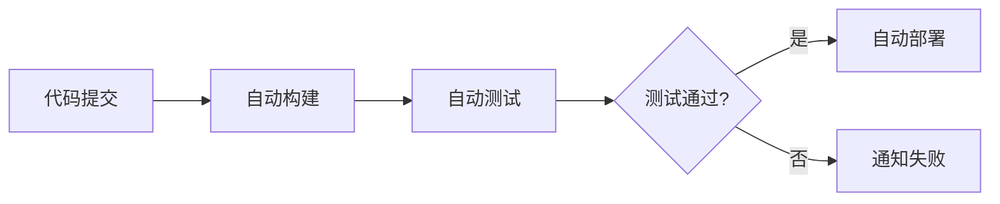

CI/CD 是现代软件开发中的重要实践，我来详细讲解一下：

## CI/CD 基本概念

### CI (Continuous Integration) - 持续集成
- **定义**：开发人员频繁地将代码变更合并到主分支，并通过自动化构建和测试验证这些变更
- **核心目标**：
  - 早期发现和解决集成问题
  - 提高代码质量
  - 减少手动集成的工作量

### CD (Continuous Delivery/Deployment) - 持续交付/部署
- **Continuous Delivery**：确保软件可以随时发布到生产环境
- **Continuous Deployment**：自动将通过测试的代码变更部署到生产环境

## CI/CD 核心流程

## 主要优势

### 1. 提高开发效率
- 减少手动操作和重复工作
- 快速反馈代码质量问题
- 降低集成风险

### 2. 保证软件质量
- 自动化测试覆盖
- 代码规范检查
- 安全扫描集成

### 3. 加快交付速度
- 缩短从开发到上线的周期
- 支持快速迭代
- 便于回滚和修复

## CI/CD 关键组件

### 1. 版本控制系统
- Git、SVN 等代码仓库
- 触发 CI/CD 流程的起点

### 2. 构建工具
- 编译、打包应用程序
- 如 Maven、Gradle、Webpack 等

### 3. 自动化测试
- 单元测试、集成测试、端到端测试
- 确保代码变更不会破坏现有功能

### 4. 部署工具
- 自动化部署到不同环境
- 如 Ansible、Kubernetes、Docker 等

## 实施步骤

### 1. 建立代码规范
- 统一代码风格
- 制定分支管理策略

### 2. 配置自动化构建
- 编写构建脚本
- 集成依赖管理

### 3. 设置自动化测试
- 编写测试用例
- 配置测试环境

### 4. 配置部署流程
- 定义部署策略
- 设置环境变量和配置

### 5. 监控和反馈
- 设置通知机制
- 收集部署指标

## 常用 CI/CD 工具

### 1. Jenkins
- 开源自动化服务器
- 插件生态丰富
- 高度可定制

### 2. GitLab CI/CD
- 与 GitLab 深度集成
- 配置简单直观
- 内置容器注册表

### 3. GitHub Actions
- 与 GitHub 紧密集成
- YAML 配置文件驱动
- 丰富的 Marketplace

### 4. CircleCI
- 云端 CI/CD 服务
- 配置简单快速
- 良好的性能表现

## 最佳实践

### 1. 保持主分支稳定
- 所有变更必须通过 CI 测试
- 使用特性分支开发

### 2. 快速失败原则
- 测试失败立即停止流程
- 提供清晰的错误信息

### 3. 环境一致性
- 开发、测试、生产环境尽可能一致
- 使用容器化技术保证一致性

### 4. 安全性考虑
- 代码扫描和安全检测
- 敏感信息加密存储

CI/CD 的实施需要根据团队规模、项目特点和技术栈来选择合适的工具和流程，关键是要循序渐进，持续优化。