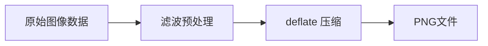

# PNG 格式详解：PNG8、PNG24、PNG32 的区别与压缩原理

## 1. PNG 格式基本概念

PNG（Portable Network Graphics）是一种无损压缩的位图图像格式，支持透明度，广泛用于网页和数字图像。

## 2. PNG8、PNG24、PNG32 的区别

### PNG8（8位PNG）

```javascript
// PNG8 特点示例
const png8Specs = {
  色彩深度: "8位",
  颜色数量: "最多256种颜色",
  调色板: "使用调色板（Palette）模式",
  透明度: "1位透明（要么完全透明，要么完全不透明）",
  文件大小: "最小",
  适用场景: "简单图形、图标、logo"
};

// 示例：PNG8 图像数据结构
// 调色板: [红, 绿, 蓝, 黄, 紫, ...] // 最多256种颜色
// 像素数据: [0, 1, 2, 0, 3, ...] // 每个像素存储调色板索引
```

### PNG24（24位PNG）

```javascript
// PNG24 特点示例
const png24Specs = {
  色彩深度: "24位",
  颜色数量: "1677万种颜色（2^24）",
  调色板: "不使用调色板，直接存储RGB值",
  透明度: "不支持透明度",
  文件大小: "较大",
  适用场景: "照片、复杂彩色图像"
};

// 示例：PNG24 像素数据结构
// 每个像素占用3个字节
// 像素1: [R=255, G=128, B=64]
// 像素2: [R=32,  G=192, B=255]
// ...
```

### PNG32（32位PNG）

```javascript
// PNG32 特点示例
const png32Specs = {
  色彩深度: "32位",
  颜色数量: "1677万种颜色 + 256级透明度",
  调色板: "不使用调色板，直接存储RGBA值",
  透明度: "8位Alpha通道（256级透明度）",
  文件大小: "最大",
  适用场景: "需要半透明效果的复杂图像"
};

// 示例：PNG32 像素数据结构
// 每个像素占用4个字节
// 像素1: [R=255, G=128, B=64,  A=128]  // 50%透明度
// 像素2: [R=32,  G=192, B=255, A=255]  // 完全不透明
// 像素3: [R=100, G=50,  B=200, A=0]    // 完全透明
```

## 3. 对比表格

| 特性 | PNG8 | PNG24 | PNG32 |
|------|------|-------|-------|
| 颜色深度 | 8位 | 24位 | 32位 |
| 最大颜色数 | 256 | 1677万 | 1677万 |
| 透明度支持 | 1位（全透/不透） | 无 | 8位（256级） |
| 调色板使用 | 是 | 否 | 否 |
| 文件大小 | 最小 | 中等 | 最大 |
| 典型用途 | 图标、简单图形 | 照片 | 半透明图像 |

## 4. PNG 压缩原理

### PNG 压缩流程



### 详细压缩步骤：

#### 步骤1：滤波预处理（Filtering）

```javascript
// PNG使用5种滤波器减少数据冗余
const filterTypes = {
  None: 0,      // 不过滤
  Sub: 1,       // 与左侧像素的差值
  Up: 2,        // 与上方像素的差值
  Average: 3,   // 与左侧和上方像素平均值的差值
  Paeth: 4      // 预测滤波
};

// 示例：Sub滤波器工作原理
function subFilter(scanline, previousScanline) {
  // 原始数据: [100, 102, 101, 103, 100]
  // Sub滤波后: [100, 2, -1, 2, -3]
  // 因为每个像素与前一个像素的差值通常较小，更易压缩
  const filtered = new Array(scanline.length);
  filtered[0] = scanline[0]; // 第一个像素不变
  
  for (let i = 1; i < scanline.length; i++) {
    filtered[i] = (scanline[i] - scanline[i-1]) & 0xFF;
  }
  
  return filtered;
}
```

#### 步骤2：Deflate压缩

```javascript
// Deflate算法结合了LZ77和霍夫曼编码

// LZ77 - 查找重复数据
function lz77Compress(data) {
  // 示例：原始数据 "ABABAB"
  // 压缩后：(0,0,'A')(0,0,'B')(2,4)
  // 表示：字符A，字符B，回到前面2个位置复制4个字符
  return compressedData;
}

// 霍夫曼编码 - 根据频率分配编码长度
function huffmanEncode(frequencyTable) {
  // 高频字符用短编码，低频字符用长编码
  // 例如：
  // A: 出现频率40% -> 编码 0
  // B: 出现频率30% -> 编码 10
  // C: 出现频率20% -> 编码 110
  // D: 出现频率10% -> 编码 111
  return huffmanTree;
}
```

### PNG 压缩示例

```javascript
// 简化的PNG压缩过程演示
class SimplePNGCompressor {
  compress(imageData) {
    // 1. 按扫描线分割图像数据
    const scanlines = this.splitIntoScanlines(imageData);
    
    // 2. 对每条扫描线应用最优滤波器
    const filteredScanlines = scanlines.map((scanline, index) => {
      const previousScanline = index > 0 ? scanlines[index-1] : null;
      return this.applyBestFilter(scanline, previousScanline);
    });
    
    // 3. 合并所有扫描线
    const filteredData = this.mergeScanlines(filteredScanlines);
    
    // 4. 应用deflate压缩
    const compressedData = this.deflateCompress(filteredData);
    
    return compressedData;
  }
  
  applyBestFilter(scanline, previousScanline) {
    // 尝试所有滤波器，选择压缩效果最好的
    const filters = [
      this.noneFilter(scanline),
      this.subFilter(scanline),
      this.upFilter(scanline, previousScanline),
      this.averageFilter(scanline, previousScanline),
      this.paethFilter(scanline, previousScanline)
    ];
    
    // 简化：选择字节值总和最小的（通常更易压缩）
    const bestFilter = filters.reduce((best, current) => {
      const currentSum = current.data.reduce((sum, byte) => sum + Math.abs(byte), 0);
      const bestSum = best.data.reduce((sum, byte) => sum + Math.abs(byte), 0);
      return currentSum < bestSum ? current : best;
    });
    
    return bestFilter;
  }
}
```

## 5. PNG 压缩优化技巧

### 选择合适的PNG类型

```html
<!-- 根据图像特点选择合适的PNG格式 -->
<!-- 简单图标使用PNG8 -->
 <!-- PNG8，文件小 -->

<!-- 照片使用PNG24 -->
 <!-- PNG24，色彩丰富 -->

<!-- 需要透明度的复杂图像使用PNG32 -->
 <!-- PNG32，支持alpha通道 -->
```

### 预处理优化

```javascript
// 图像预处理以提高PNG压缩率
const preprocessingTechniques = {
  // 1. 减少颜色数量以适应PNG8
  reduceColors: function(imageData, maxColors = 256) {
    // 使用八叉树或中值切割算法减少颜色
    return reducedImageData;
  },
  
  // 2. 优化调色板顺序
  optimizePalette: function(palette) {
    // 将相似颜色放在一起，提高滤波效果
    return optimizedPalette;
  },
  
  // 3. 预处理以创建更多重复模式
  patternEnhancement: function(imageData) {
    // 平滑渐变，减少噪点等
    return enhancedImageData;
  }
};
```

## 6. 实际应用建议

### 根据使用场景选择格式

```javascript
// 选择PNG格式的决策树
function choosePNGFormat(imageCharacteristics) {
  if (imageCharacteristics.colors <= 256) {
    if (imageCharacteristics.requiresTransparency) {
      if (imageCharacteristics.requiresAlphaTransparency) {
        return "PNG32"; // 需要半透明
      } else {
        return "PNG8";  // 只需要1位透明
      }
    } else {
      return "PNG8";    // 不需要透明度
    }
  } else {
    if (imageCharacteristics.requiresTransparency) {
      return "PNG32";   // 多色图像且需要透明度
    } else {
      return "PNG24";   // 多色图像，不需要透明度
    }
  }
}

// 使用示例
const imageInfo = {
  colors: 100,
  requiresTransparency: true,
  requiresAlphaTransparency: true
};

const recommendedFormat = choosePNGFormat(imageInfo);
console.log(`推荐使用: ${recommendedFormat}`); // 输出: 推荐使用: PNG32
```

## 总结

PNG格式通过以下方式实现压缩：

1. **滤波预处理**：减少相邻像素间的相关性
2. **Deflate压缩**：使用LZ77和霍夫曼编码消除冗余
3. **格式选择**：根据图像特点选择PNG8/24/32以平衡质量和文件大小

选择合适的PNG格式和使用优化工具可以显著减少文件大小，提高网页加载速度。